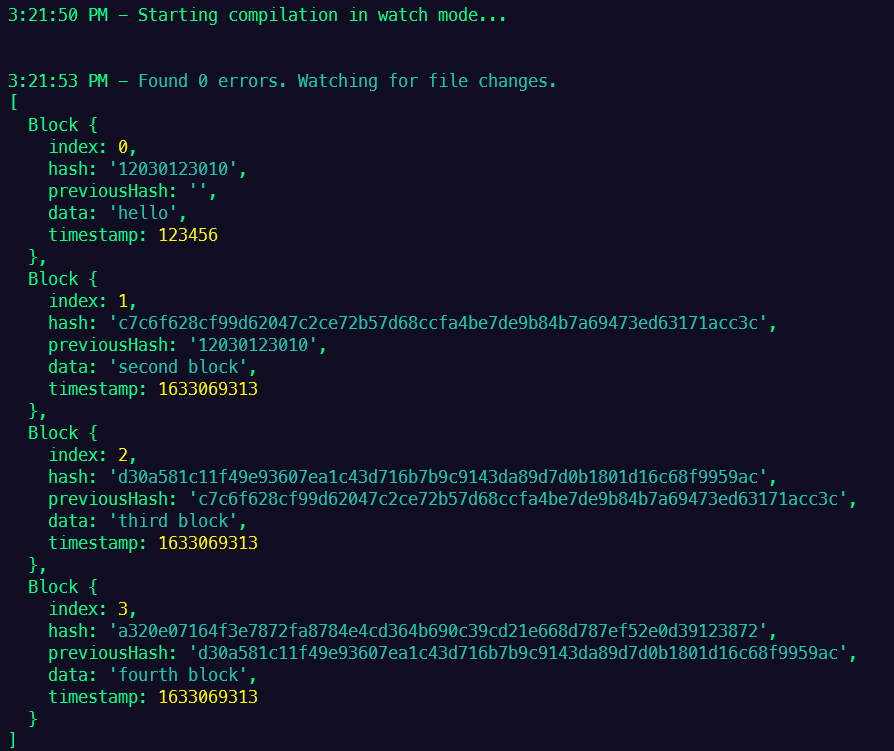

사용 방법
===
다운로드 및 패키지 설치
---
* ### 다운로드

```PowerShell
git clone https://github.com/basalcode/typechain.git
```
* ### 패키지 설치
```PowerShell
npm install

또는

yarn
```
시작하기
---
```PowerShell
npm run start

또는

yarn start
```
terminal을 확인해서 다음과 같은 결과가 나왔다면 성공!

<br />

Configuration
---
* ### tsconfig.json
```JSON
{
    "compilerOptions": {
        "module": "CommonJS", // Node.js 에서 import export 사용 가능
        "target": "ES2015", // 변환할 JS 문법
        "sourceMap": true, // 컴파일 시, 디버그가 가능한 source맵을 생성
        "outDir": "dist" // 컴파일 결과를 담을 폴더
    },
    "include": ["src/**/*"], // 컴파일할 파일의 시작점
    "exclude": ["node_modules"] // 컴파일 하지 않도록 제외
}
```
* ### package.json
```JSON
{
  "name": "typechain",
  "version": "1.0.0",
  "main": "index.js",
  "license": "MIT",
  "script": {
    "start": "tsc-watch --onSuccess \" node dist/index.js\" " // tsc-watch - nodemon for typescript
    // "start": "node index.js", // 컴파일 된 index.js 파일을 노드에 전달
    // "prestart": "tsc" // yarn start 시 먼저 실행
  } 
}
```

> 참조 링크: https://nomadcoders.co/typescript-for-beginners/lobby<br />